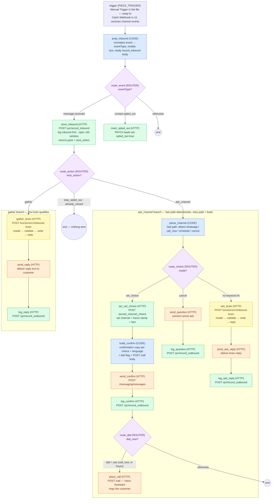

# AF flows — import, wire, test

Two flows run the product today:

| Flow | File | Trigger |
| --- | --- | --- |
| Send WA Template (init) | live in AF already (regenerate with `.cursor/skills/amira-create-wa-template-flow/` if ever lost) | Called with `{ name, phone, vehicle, language }` from the form webhook |
| Amira Inbound WhatsApp | `flows/amira-inbound-whatsapp.json` | Imports with a **Manual Trigger** — swap to Catch Webhook in the UI after import |

> Re-import needed (2026-09-17): the generated flow gained a dial branch
> (`route_dial` → `place_call`) so the keyword fast path actually places the
> call it promises. Import the fresh JSON, swap the trigger, re-point the
> channel `webhookUrl`.

Import rules come from the team's own skill repo ([AC-Group2/agenticflow-studio](https://github.com/AC-Group2/agenticflow-studio), `activepieces-flow-builder`): SHARED wrapper with `flows[]` + `metadata.externalId`, schema `22`, and **the imported first piece must be a Manual Trigger** — webhook-first flows import with an empty trigger (exactly what we saw). Every step, code and routers included, carries `lastUpdatedDate`, `sampleData`, and per-input `propertySettings`. Validate before importing:

```bash
python3 flows/validate_flow.py flows/amira-inbound-whatsapp.json
```

`flows/amira-inbound-whatsapp.json` is generated — edit `flows/build-inbound-flow.mjs` and rerun `node flows/build-inbound-flow.mjs`. Do not hand-edit the JSON. The generator also writes `flows/snippets/*.js` — the three Code node sources, paste-ready.

**Debugging imports:** "No valid templates found" = wrong wrapper (needs the SHARED `flows[]` shape). Flow created with an **empty trigger** = the imported first piece was a webhook/schedule trigger (must be Manual Trigger, swapped in the UI after). "Template file is invalid" = run `flows/validate_flow.py` — usually a missing per-step key. Red nodes after a successful import = unresolved `{{variables['…']}}` or a piece-version prompt (accept what AF offers). Last resort: rebuild by hand from the node list below; Code bodies are paste-ready in `flows/snippets/`.

## Reset test data

One reusable mechanism (skill: `.cursor/skills/amira-reset-test-data/`) — the
`reset_test_data()` RPC truncates every public table and returns the counts it
wiped. Run any of:

```sql
select public.reset_test_data();          -- SQL editor or Supabase MCP
```

```bash
tools/reset-test-data.sh                   # local (service key in env or .env)
```

Useful checks after a test conversation:

```sql
-- lead state machine
select mobile_e164, status, current_step, current_channel, opted_out, preferred_call_at from leads;
-- coverage (including declines)
select key, value, declined, step from facts order by at;
-- what the model tried vs what the executor allowed, with latency
select at, text, meta->>'model_ms' as model_ms, meta->>'total_ms' as total_ms
from messages where meta->>'kind' = 'brain_audit' order by at;
-- full transcript
select at, direction, text from messages order by at;
```

## Diagram — inbound flow (labels = AF step names)

AF's canvas supports sticky notes (`flows[0].notes[]` in the schema), but they are untested on import and the file finally imports clean — so the flow documentation lives here instead.



Colors: blue = Code (isolated-vm JS), green = Supabase store call, orange = AgenticFlow send, **yellow = inbound-brain (model → validate → write → reply)**, purple = router.

## Workspace variables (Dashboard → Variables)

| Variable | Value |
| --- | --- |
| `AgenticFlow_API_KEY` | workspace API key (already exists) |
| `SUPABASE_SERVICE_ROLE_KEY` | amira project service-role key. Store writes + auth for `inbound-brain`. |

(`AMIRA_CHAT_ASSISTANT_ID` is gone — the AF chat assistant was replaced by our own `inbound-brain` Edge Function.)

## inbound-brain (the model turn)

Deployed at `…/functions/v1/inbound-brain`. The flow POSTs `{ pack, text, message_id }` with the service-key headers; the function runs model → validate → write state → return `{ reply, applied, rejected, fallback, latency }`. Source: `supabase/functions/inbound-brain/` + `_shared/brain-contract.ts` (action allowlists, transitions, catalogue-grounded value checks) + `_shared/catalogue.ts` (generated: `node tools/catalogue/emit-module.mjs`).

**Model provider — AF-first.** Primary: AgenticFlow `/chat/message` through assistant **Amira Brain** (`8ef58e44-6de1-48ec-8d76-189e8595fd7f`, type pipeline, gpt-5.4-mini, KB Amira attached — already created and smoke-tested; details in `supabase/functions/inbound-brain/ASSISTANT_PROMPT.md`). Set the secrets (Supabase → Edge Functions → Secrets):

```bash
supabase secrets set AGENTICFLOW_API_KEY=<workspace API key>
supabase secrets set BRAIN_AF_ASSISTANT_ID=8ef58e44-6de1-48ec-8d76-189e8595fd7f
```

Fallback provider (only used when the AF pair is unset): any OpenAI-compatible endpoint via `BRAIN_API_KEY` (+ optional `BRAIN_MODEL`, `BRAIN_API_URL`).

**Voice slice secrets** (the brain dials on call_now-in-hours; `voice-hub` receives the end-of-call report):

```bash
supabase secrets set VOICE_ASSISTANT_ID=bb7401d6-b4ba-45e1-98b2-948a74448ed5
supabase secrets set VOICE_HUB_SECRET=<printed at assistant creation — also on the assistant server.secret>
```

Without them the brain logs `dial:skipped` and `voice-hub` 401s everything. Voice prompt + extraction schema: `supabase/functions/voice-hub/VOICE_ASSISTANT.md`.

With neither configured the function still answers — deterministic per-step fallback questions — so the flow is testable before any model exists. Every turn writes an audit row (`messages`, `meta.kind = brain_audit`) with `provider`, applied/rejected actions, and `model_ms`/`total_ms`.

## Wire the inbound flow

1. Import `flows/amira-inbound-whatsapp.json`.
2. In the flow editor, **replace the Manual Trigger with Catch Webhook** (accept whatever webhook piece version AF offers), then publish.
3. Check the `prep_inbound` step: its `evt` input should read the trigger body (`{{trigger['body']}}`). The code also tries `{{trigger['output']['body']}}` as a fallback, so normally nothing to fix — if a test run shows both empty, point `evt` at the trigger body in the UI.
4. Copy the webhook URL. Messaging → channel **Amira AI - almost human** (`160e6c61-…`) → set `webhookUrl` to it.
5. Test without touching WhatsApp: POST a sample at the flow's test URL:

```bash
curl -X POST "<catch-webhook-test-url>" \
  -H "Content-Type: application/json" \
  -d @flows/samples/message-received.text-ar.json
```

Samples: `message-received.text-ar.json` (channel answer "ابغى اكمل واتساب"), `.text-en.json` ("call me now please"), `.button-confirm.json` (template button tap — routes to the channel question), `contact-opted-out.json` (suppression), `form-webhook.ar/.en.json` (what `request-call` POSTs to the init flow — paste into that flow's test panel instead of typing).

Replace `+966500000001` with your own test number for live sends. Sends reach real phones.

## Inbound flow, node by node (rebuild fallback)

Shape: `Trigger → Code prep_inbound (normalizes the event) → Router(eventType) → [message.received → HTTP record_inbound → Router(next_action)], [contact.opted_out → HTTP PATCH leads], [Otherwise → end]`

Only `prep_inbound` reads the trigger; every later node reads `prep_inbound['output']` (`eventType`, `mobile`, `text`, `body`). That makes the trigger swap a one-field concern.

**Store HTTP headers** (every Supabase call): `Content-Type: application/json`, `apikey: {{variables['SUPABASE_SERVICE_ROLE_KEY']}}`, `Authorization: Bearer {{variables['SUPABASE_SERVICE_ROLE_KEY']}}`.
**AF HTTP headers** (messaging/chat): `Content-Type: application/json`, `X-Api-Key: {{variables['AgenticFlow_API_KEY']}}`.

1. **prep_inbound** (Code) — inputs `evt={{trigger['body']}}`, `evtAlt={{trigger['output']['body']}}`. Returns `{ eventType, mobile, text, body: { p_mobile, p_text, p_channel, p_meta } }` with a `[type message]` fallback for empty text. Code: `flows/snippets/prep_inbound.js`.
2. **route_event** (Router, first match) — on `{{prep_inbound['output']['eventType']}}`: `message.received` → store_inbound…, `contact.opted_out` → mark_opted_out, Otherwise → end.
3. **store_inbound** (HTTP POST) — `https://tmewbswbhnmuuomdfewq.supabase.co/rest/v1/rpc/record_inbound`, JSON Body `{{prep_inbound['output']['body']}}`. Response body is the lead pack.
4. **route_action** (Router, first match) — on `{{store_inbound['output']['body']['next_action']}}`:
   - `ask_channel` → **parse_channel** (Code, `flows/snippets/parse_channel.js`): fast path — 1/2/3, WhatsApp/call/schedule keywords (AR + EN + Arabizi-ish), cancel words. Inputs: `pack={{store_inbound['output']['body']}}`, `text={{prep_inbound['output']['text']}}`, `mobile={{prep_inbound['output']['mobile']}}`. Outputs `mode` (`set_choice` \| `cancel` \| `ask`), `choice`, `rpcBody`, `sendBody`, `logBody`.
     - Router `mode == set_choice` → **rpc_set_choice** (HTTP POST `…/rpc/set_channel_choice`, body `{{parse_channel['output']['rpcBody']}}`) → **build_confirm** (Code, `flows/snippets/build_confirm.js`; also emits `dial` yes/no + the ready `callBody`) → **send_confirm** (messaging send) → **log_confirm** (`record_outbound`) → **route_dial** (Router on `{{build_confirm['output']['dial']}}` = `yes`) → **place_call** (HTTP POST `https://api.ae.agenticflow.studio/call`, AF headers, JSON Body `{{build_confirm['output']['callBody']}}` — assistant + phone number ids are baked into the generated body).
     - `mode == cancel` → **send_question** (canned cancel ack, `{{parse_channel['output']['sendBody']}}`) → **log_question** (`record_outbound`).
     - Otherwise (no keyword hit — off-topic, essays, implied choices, missed opt-outs) → **ask_brain** (HTTP POST `…/functions/v1/inbound-brain`, store headers, body `{ pack: {{store_inbound…body}}, text, message_id }`) → **send_ask_reply** (messaging send, `text.body = {{ask_brain['output']['body']['reply']}}`) → **log_ask_reply** (`record_outbound`).
   - `gather` → **gather_brain** (HTTP POST `…/functions/v1/inbound-brain`, same body) → **send_reply** (messaging send, `text.body = {{gather_brain['output']['body']['reply']}}`) → **log_reply** (`record_outbound`).
   - Otherwise (`stop_opted_out`, `already_closed`) → end. Nothing is sent.
5. **mark_opted_out** (HTTP PATCH) — `…/rest/v1/leads?mobile_e164=eq.{{prep_inbound['output']['mobile']}}`, header `Prefer: return=minimal`, body `{ "opted_out": true }`.

No `can-send` call on this path: the customer just messaged us, so the 24h window is open by definition. `can-send` is only for sends that are *not* replies (recap after a call, ghost nudges — those are templates anyway).

## Design notes

- The model never runs before `record_inbound` — the inbound text is indexed first, per the store contract.
- Deterministic floors stay outside the model: opt-out regex + platform events, 24h window, hours clamp, channel fast path. The brain decides meaning; the executor validates; the store is written before the reply leaves the function.
- Store round-trips per turn: 1 read+write (`record_inbound`) + brain writes (inside the function) + 1 log write.
- The dial fires exactly once per choice, from whichever path recorded it: keyword fast path → `place_call` node; semantic brain path → `placeCall` inside the brain's executor. The two paths never both run on one turn.
- Known gaps: schedule-a-call time capture is model-dependent (`preferred_call_at` still null unless the brain emits it); cancel ack doesn't close the lead; scheduled/out-of-hours calls wait on the ghost scheduler (nothing dials at `preferred_call_at` yet); the brain's Najdi register needs the gate/evals before demo.
