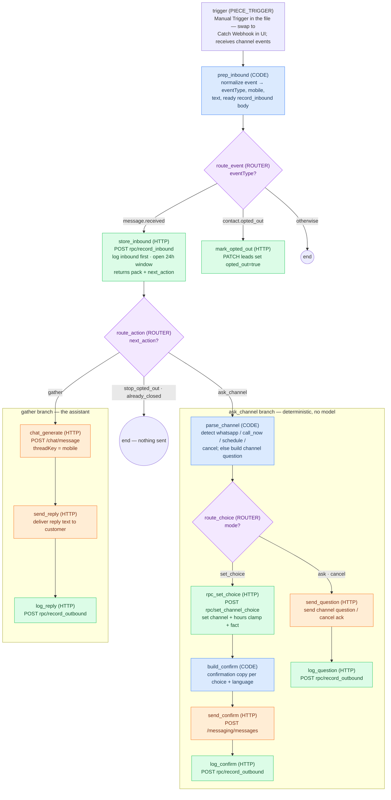

# AF flows — import, wire, test

Two flows run the product today:

| Flow | File | Trigger |
| --- | --- | --- |
| Send WA Template (init) | `whatsapp-send-template.json` (live in AF already) | Called with `{ name, phone, vehicle, language }` from the form webhook |
| Amira Inbound WhatsApp | `flows/amira-inbound-whatsapp.json` | Imports with a **Manual Trigger** — swap to Catch Webhook in the UI after import |

Import rules come from the team's own skill repo ([AC-Group2/agenticflow-studio](https://github.com/AC-Group2/agenticflow-studio), `activepieces-flow-builder`): SHARED wrapper with `flows[]` + `metadata.externalId`, schema `22`, and **the imported first piece must be a Manual Trigger** — webhook-first flows import with an empty trigger (exactly what we saw). Every step, code and routers included, carries `lastUpdatedDate`, `sampleData`, and per-input `propertySettings`. Validate before importing:

```bash
python3 flows/validate_flow.py flows/amira-inbound-whatsapp.json
```

`flows/amira-inbound-whatsapp.json` is generated — edit `flows/build-inbound-flow.mjs` and rerun `node flows/build-inbound-flow.mjs`. Do not hand-edit the JSON. The generator also writes `flows/snippets/*.js` — the three Code node sources, paste-ready.

**Debugging imports:** "No valid templates found" = wrong wrapper (needs the SHARED `flows[]` shape). Flow created with an **empty trigger** = the imported first piece was a webhook/schedule trigger (must be Manual Trigger, swapped in the UI after). "Template file is invalid" = run `flows/validate_flow.py` — usually a missing per-step key. Red nodes after a successful import = unresolved `{{variables['…']}}` or a piece-version prompt (accept what AF offers). Last resort: rebuild by hand from the node list below; Code bodies are paste-ready in `flows/snippets/`.

## Diagram — inbound flow (labels = AF step names)

AF's canvas supports sticky notes (`flows[0].notes[]` in the schema), but they are untested on import and the file finally imports clean — so the flow documentation lives here instead.



Colors: blue = Code (isolated-vm JS), green = Supabase store call, orange = AgenticFlow send/chat, purple = router.

## Workspace variables (Dashboard → Variables)

| Variable | Value |
| --- | --- |
| `AgenticFlow_API_KEY` | workspace API key (already exists) |
| `SUPABASE_SERVICE_ROLE_KEY` | amira project service-role key. Store writes only. |
| `AMIRA_CHAT_ASSISTANT_ID` | chat-capable assistant with KB **Amira** attached (create it, then paste the id) |

## Wire the inbound flow

1. Import `flows/amira-inbound-whatsapp.json`.
2. In the flow editor, **replace the Manual Trigger with Catch Webhook** (accept whatever webhook piece version AF offers), then publish.
3. Check the `prep_inbound` step: its `evt` input should read the trigger body (`{{trigger['body']}}`). The code also tries `{{trigger['output']['body']}}` as a fallback, so normally nothing to fix — if a test run shows both empty, point `evt` at the trigger body in the UI.
4. Copy the webhook URL. Messaging → channel **Amira AI - almost human** (`160e6c61-…`) → set `webhookUrl` to it.
5. Test without touching WhatsApp: POST a sample at the flow's test URL:

```bash
curl -X POST "<catch-webhook-test-url>" \
  -H "Content-Type: application/json" \
  -d @flows/samples/message-received.text-ar.json
```

Samples: `message-received.text-ar.json` (channel answer "ابغى اكمل واتساب"), `.text-en.json` ("call me now please"), `.button-confirm.json` (template button tap — routes to the channel question), `contact-opted-out.json` (suppression), `form-webhook.ar/.en.json` (what `request-call` POSTs to the init flow — paste into that flow's test panel instead of typing).

Replace `+966500000001` with your own test number for live sends. Sends reach real phones.

## Inbound flow, node by node (rebuild fallback)

Shape: `Trigger → Code prep_inbound (normalizes the event) → Router(eventType) → [message.received → HTTP record_inbound → Router(next_action)], [contact.opted_out → HTTP PATCH leads], [Otherwise → end]`

Only `prep_inbound` reads the trigger; every later node reads `prep_inbound['output']` (`eventType`, `mobile`, `text`, `body`). That makes the trigger swap a one-field concern.

**Store HTTP headers** (every Supabase call): `Content-Type: application/json`, `apikey: {{variables['SUPABASE_SERVICE_ROLE_KEY']}}`, `Authorization: Bearer {{variables['SUPABASE_SERVICE_ROLE_KEY']}}`.
**AF HTTP headers** (messaging/chat): `Content-Type: application/json`, `X-Api-Key: {{variables['AgenticFlow_API_KEY']}}`.

1. **prep_inbound** (Code) — inputs `evt={{trigger['body']}}`, `evtAlt={{trigger['output']['body']}}`. Returns `{ eventType, mobile, text, body: { p_mobile, p_text, p_channel, p_meta } }` with a `[type message]` fallback for empty text. Code: `flows/snippets/prep_inbound.js`.
2. **route_event** (Router, first match) — on `{{prep_inbound['output']['eventType']}}`: `message.received` → store_inbound…, `contact.opted_out` → mark_opted_out, Otherwise → end.
3. **store_inbound** (HTTP POST) — `https://tmewbswbhnmuuomdfewq.supabase.co/rest/v1/rpc/record_inbound`, JSON Body `{{prep_inbound['output']['body']}}`. Response body is the lead pack.
4. **route_action** (Router, first match) — on `{{store_inbound['output']['body']['next_action']}}`:
   - `ask_channel` → **parse_channel** (Code, `flows/snippets/parse_channel.js`): parses 1/2/3, WhatsApp/call/schedule keywords (AR + EN + Arabizi-ish), cancel words. Inputs: `pack={{store_inbound['output']['body']}}`, `text={{prep_inbound['output']['text']}}`, `mobile={{prep_inbound['output']['mobile']}}`. Outputs `mode`, `choice`, `rpcBody`, `sendBody`, `logBody`.
     - Router `mode == set_choice` → **rpc_set_choice** (HTTP POST `…/rpc/set_channel_choice`, body `{{parse_channel['output']['rpcBody']}}`) → **build_confirm** (Code, `flows/snippets/build_confirm.js`; inputs `pack={{rpc_set_choice['output']['body']}}`, `choice={{parse_channel['output']['choice']}}`, `mobile` — copy per choice + language, outside-hours variant from `call_window`) → **send_confirm** (HTTP POST `https://api.ae.agenticflow.studio/messaging/messages`, body `{{build_confirm['output']['sendBody']}}`) → **log_confirm** (HTTP POST `…/rpc/record_outbound`, body `{{build_confirm['output']['logBody']}}`).
     - Otherwise → **send_question** (messaging send, body `{{parse_channel['output']['sendBody']}}` — the canned channel question or cancel ack) → **log_question** (`record_outbound`, `{{parse_channel['output']['logBody']}}`).
   - `gather` → **chat_generate** (HTTP POST `https://api.ae.agenticflow.studio/chat/message`, body `{ channelId: 160e6c61-…, threadKey: {{prep_inbound['output']['mobile']}}, content: {{prep_inbound['output']['text']}}, assistantId: {{variables['AMIRA_CHAT_ASSISTANT_ID']}} }`) → **send_reply** (messaging send, `text.body = {{chat_generate['output']['body']['data']['message']['content']}}`) → **log_reply** (`record_outbound`).
   - Otherwise (`stop_opted_out`, `already_closed`) → end. Nothing is sent.
5. **mark_opted_out** (HTTP PATCH) — `…/rest/v1/leads?mobile_e164=eq.{{prep_inbound['output']['mobile']}}`, header `Prefer: return=minimal`, body `{ "opted_out": true }`.

No `can-send` call on this path: the customer just messaged us, so the 24h window is open by definition. `can-send` is only for sends that are *not* replies (recap after a call, ghost nudges — those are templates anyway).

## Design notes

- The model never runs before `record_inbound` — the inbound text is indexed first, per the store contract.
- `ask_channel` is deterministic. The chat assistant only sees `gather` turns.
- Store round-trips per turn: 1 read+write (`record_inbound`) + 1 log write. `set_channel_choice` adds one more only on the choice turn.
- Known gaps: schedule-a-call captures no time yet (`preferred_call_at` null, open thread "call time pending"); cancel ack doesn't close the lead; dialer doesn't exist, so `call_now` records the choice but no call fires; facts beyond `preferred_channel` are not extracted during gather.
